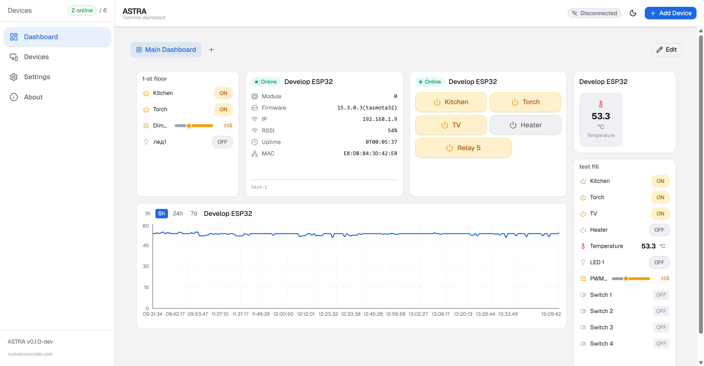

# ASTRA — Admin System for Tasmota Remote Access

> Browser-based admin panel for Tasmota ESP32 devices

  

**Website:** [www.rocketcontroller.com](https://www.rocketcontroller.com) | **Live App:** [astra-app.rocketcontroller.com](https://astra-app.rocketcontroller.com)



## Features

- Dashboard with customizable drag-and-drop widgets
- Device management with online/offline monitoring
- Relay / PWM / LED / Sensor / Energy monitoring and control
- Visual Rule Builder with templates
- Timer management (16 slots per device)
- GPIO entity mapping
- Config sync to device (Berry-based storage on ESP32)
- Dark mode
- PWA support (installable, works offline)

## Quick Start

### Prerequisites

- **Node.js 18+**
- **ESP32** with **Tasmota 14+** on the same network
- CORS enabled on device (`SetOption120 1`) — see [CORS setup](docs/CORS-setup.md)

> **ESP32 only.** ESP8266 is not supported — Berry scripting (used for SSE push and config storage) is not available on ESP8266.

### Pre-compiled Tasmota Firmware (optional)

A CORS-patched Tasmota firmware for ESP32 is available in [Releases](https://github.com/robotdyn-dimmer/ASTRA-tasmota-dashboard/releases). It adds the `Access-Control-Allow-Private-Network` header required by Chrome 98+ for local network access. Flash via OTA update or esptool. Built from Tasmota development branch.

### Try Online (no install needed)

Open **[astra-app.rocketcontroller.com](https://astra-app.rocketcontroller.com)** in your browser, add your device IP, and start managing. Requires CORS-patched firmware on the device.

### Install and Run Locally

```bash
git clone https://github.com/robotdyn-dimmer/ASTRA-tasmota-dashboard.git
cd ASTRA-tasmota-dashboard
npm install
npm run dev
```

Open `http://localhost:5173` in your browser and add your first device via **+ Add Device**.

### Production Build

```bash
npm run build
npm run preview
```

## Documentation

Full documentation is in the [`docs/`](docs/) folder:

- [User Guide](docs/user-guide.md) — complete walkthrough of all features
- [CORS Setup](docs/CORS-setup.md) — browser security configuration
- [Berry Setup](docs/berry-setup.md) — SSE push and config storage scripts for ESP32

## Tech Stack

React 19 + TypeScript + Vite + Tailwind CSS v4 + shadcn/ui + Zustand + Recharts + react-grid-layout

Communication: HTTP (primary) + MQTT (optional) + SSE (real-time push via Berry)

## Contributing & Feedback

ASTRA is a free, open-source project. We don't charge for it and we don't plan to. The codebase is actively developed and optimized — yes, we use AI tools to help us move faster, and we're not ashamed of it.

If you find a bug, have a feature request, or just want to share your experience — please [open an issue](https://github.com/robotdyn-dimmer/ASTRA-tasmota-dashboard/issues). We read every one of them and fix things quickly.

Pull requests are welcome too.

## License

MIT

---

Built by the **[RocketController](https://www.rocketcontroller.com)** team | [info@rocketcontroller.com](mailto:info@rocketcontroller.com)
