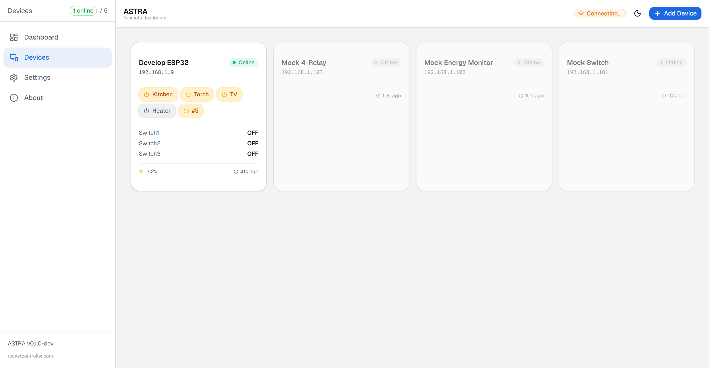
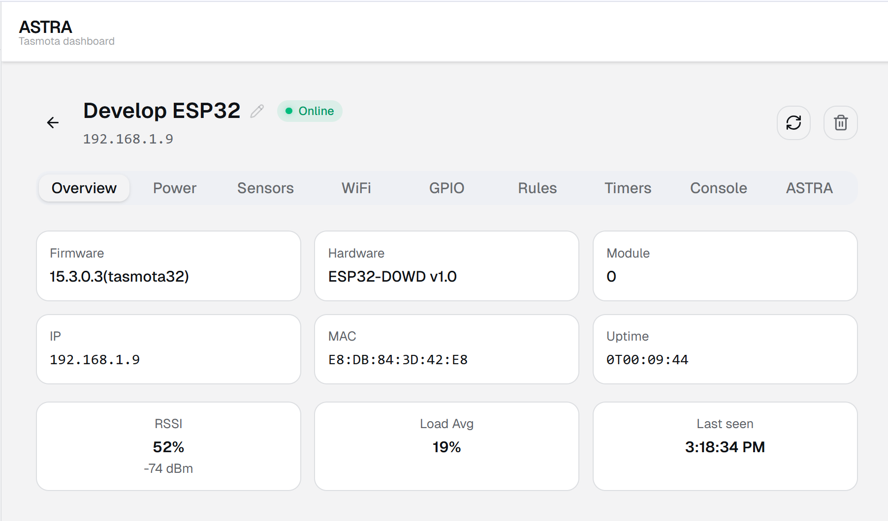
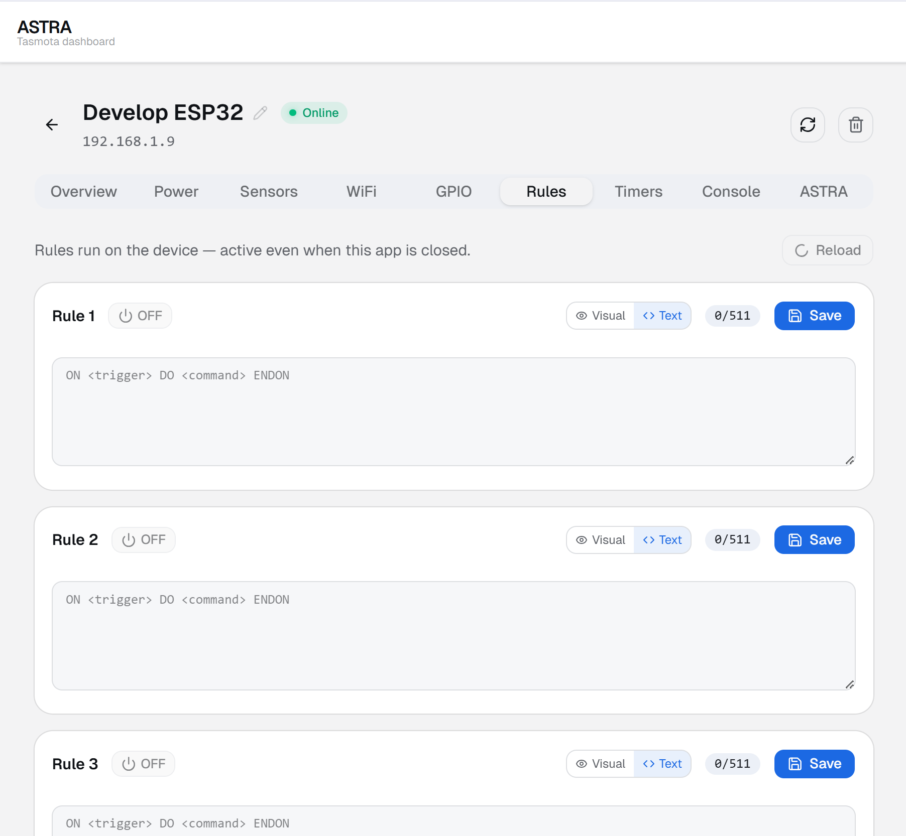
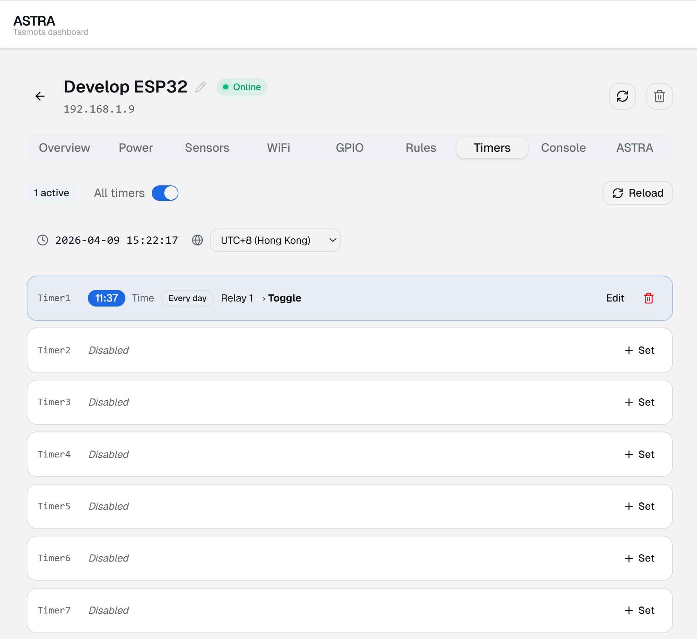
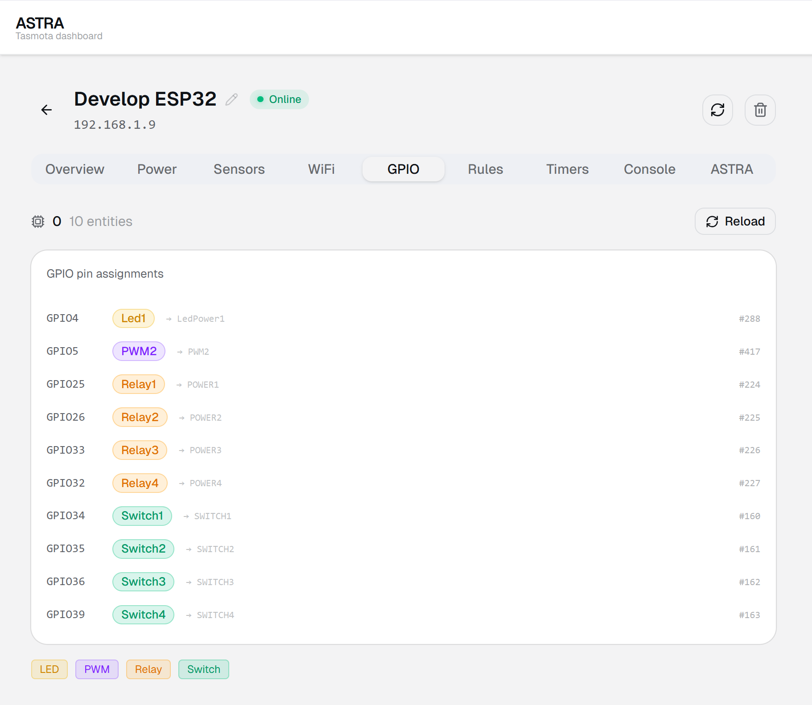
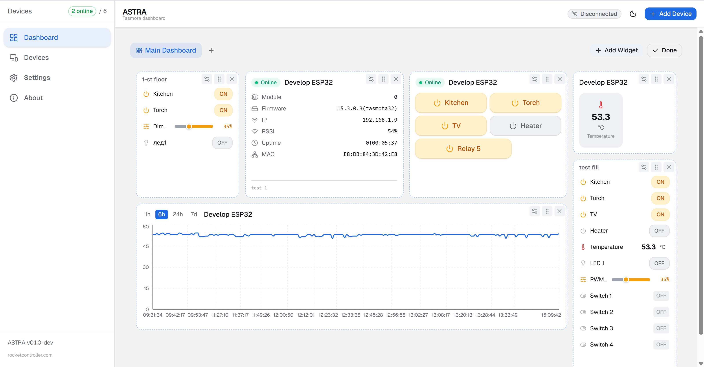
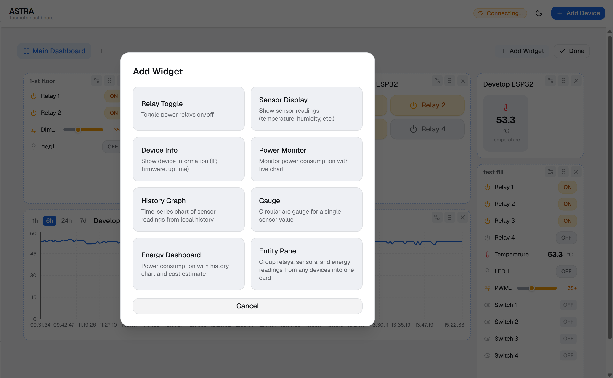
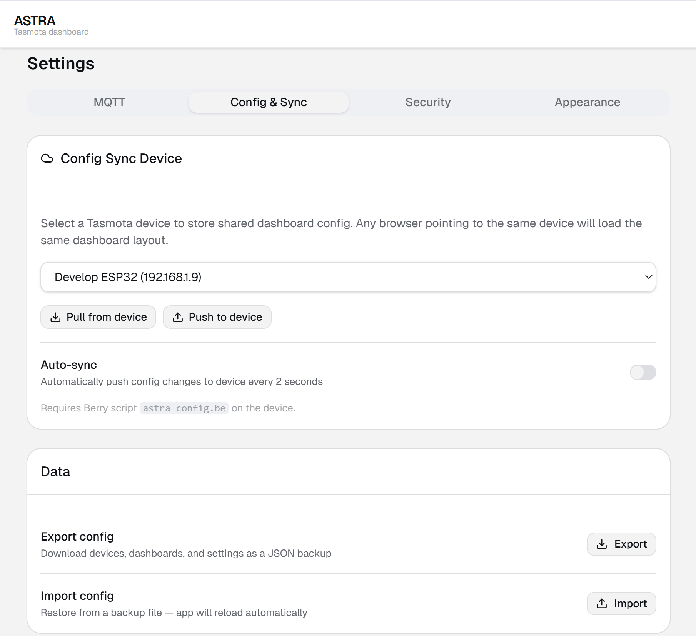
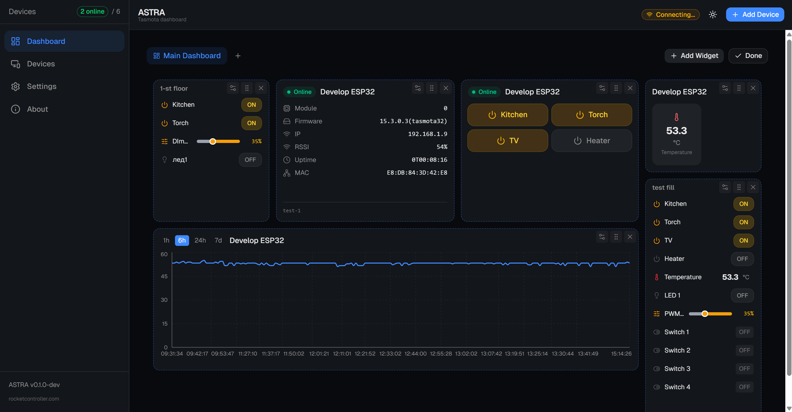

# ASTRA User Guide

## Getting Started

### Prerequisites

- An **ESP32** running **Tasmota 14+** on the same local network as your browser
- CORS enabled on the device — see [CORS Setup](CORS-setup.md)
- (Optional) Berry scripts uploaded for SSE push and config sync — see [Berry Setup](berry-setup.md)

### First Launch

1. Run `npm run dev` and open `http://localhost:5173`
2. The app opens directly to the Dashboard
3. Add your first device using the **+ Add Device** button
4. ASTRA connects and pulls device status automatically


---

## Devices

### Adding a Device

Click the **+ Add Device** button in the sidebar or device list. Enter the device IP address. ASTRA queries the device for its name, relay count, firmware version, and sensor data.

### Device Cards

Each device appears as a card showing:

| Field | Description |
|-------|-------------|
| Name | Device friendly name (from Tasmota) |
| Status | Online (green) or Offline (red) |
| Relays | Number of relay outputs |
| WiFi signal | Signal strength indicator |
| Last updated | Time since last successful poll |



### Device Detail Page

Click a device card to open the detail page.

- **Inline name editing** — click the pencil icon next to the device name to rename it
- **Delete button** — removes the device from ASTRA (does not affect the physical device)
- **Tabs:** Overview, Rules, Timers, GPIO, ASTRA Config



---

## Rules Tab

The Rules tab lets you create Tasmota automation rules. Two editing modes are available:

### Text Mode

Write raw Tasmota rule syntax directly:

```
ON Power1#State DO Publish stat/relay1 %value% ENDON
ON Time#Minute|5 DO Power1 Toggle ENDON
```

### Visual Mode

Build rules using WHEN/THEN dropdowns without knowing the syntax.

**Trigger types:**

| Trigger | Example |
|---------|---------|
| Relay | Power1 turns ON/OFF |
| Sensor | Temperature > 25 |
| Timer | Timer1 fires |
| Schedule | Every 5 minutes |
| System | Boot, WiFi connected |
| Switch | Switch1 changes state |
| Button | Button1 pressed |

**Action types:**

| Action | Description |
|--------|-------------|
| Set relay | Turn a relay ON/OFF/TOGGLE |
| Start timer | Activate a timer |
| Publish MQTT | Send MQTT message |
| Set variable | Set a Tasmota variable |

### Templates

Pre-built rule templates for common automation patterns:

- **Auto-off timer** — turn relay off after N seconds
- **Thermostat** — control relay based on temperature threshold
- **Relay mirror** — sync one relay to another
- **Schedule ON/OFF** — turn relay on/off at specific times

Click a template, customize parameters, then click **Generate** to create the rule text.



---

## Timers Tab

Tasmota supports **16 timer slots** per device.

| Setting | Description |
|---------|-------------|
| Enable/Disable | Toggle individual timer on or off |
| Time | Time picker with timezone selector |
| Days | Select days of the week |
| Output | Which relay to control |
| Action | ON, OFF, or TOGGLE |

When you save an enabled timer, ASTRA automatically enables the **Global Timers** setting on the device (required by Tasmota for timers to fire).



---

## GPIO Tab

Shows the current GPIO pin assignments from the device. Each pin displays its configured entity type.

**Entity types:**

| Type | Description |
|------|-------------|
| Relay | Output switch |
| PWM | Pulse-width modulation output |
| Button | Physical button input |
| Switch | Toggle switch input |
| Counter | Pulse counter |
| LED | Status LED |
| ADC | Analog-to-digital input |
| Sensor | Temperature, humidity, etc. |
| Energy | Power monitoring (voltage, current, watts) |



---

## Dashboard

The dashboard is a customizable grid of widgets.

### Edit Mode

Click the **pencil icon** in the header to enter edit mode:

- **Move** widgets by dragging them
- **Resize** widgets by dragging the bottom-right corner
- **Configure** a widget via the gear icon
- **Delete** a widget via the X button
- Click **Done** to exit edit mode



### Adding Widgets

In edit mode, click **Add Widget**:

1. Select the widget type from the list
2. Assign a device to the widget
3. Configure widget-specific settings
4. The widget appears on the dashboard grid



---

## Widget Types

### Relay Toggle

Buttons for all relays on a device. Each button shows ON (amber highlight) or OFF state. Click to toggle.

### Entity Panel

A flexible panel that displays a mix of entities from one or multiple devices. Supported entity types: relay, PWM, LED, sensor, energy, counter, switch, ADC.

### Sensor Display

Shows temperature, humidity, and pressure readings. Choose between **grid** or **list** layout.

### History Graph

Line chart showing sensor history over time.

| Option | Values |
|--------|--------|
| Time range | 1h, 6h, 24h, 7d |
| Auto-refresh | Every 15 seconds |

### Energy Dashboard

Full energy monitoring panel:

- Real-time power (W), voltage (V), current (A)
- Energy consumption: today, yesterday, total (kWh)
- Cost calculation
- Power history chart

### Device Info

Read-only panel showing:

- Firmware version
- Uptime
- WiFi SSID and signal strength
- IP address
- MAC address

### Gauge

Circular gauge for any numeric sensor value. Configure min/max range and thresholds.

### Power Monitor

Simplified power display showing current watts and daily energy consumption.

---

## Settings

### Config Device

Select which Tasmota device stores the shared ASTRA configuration.

| Option | Behavior |
|--------|----------|
| (none) | Config stored in browser localStorage only |
| Device IP | Config synced to Berry endpoint on that device |

When a config device is set, ASTRA auto-syncs every **2 seconds** when changes are detected. This allows multiple browsers to share the same dashboard layout.

Requires the `astra_config.be` Berry script on the target device (which registers the `/astra_app` endpoint) — see [Berry Setup](berry-setup.md).

### Cross-browser sync without an ESP32 hub

If your fleet is ESP8266 only, or you simply don't want to rely on a device for storage, you can sync your config across browsers using a cloud-synced folder.

1. In **Settings → Config & Sync → Data**, click **Export config** — saves a JSON file with all devices, dashboards, and settings.
2. Save the file inside a folder synced by **Google Drive**, **Dropbox**, **OneDrive**, **Yandex.Disk**, or any similar service.
3. On another browser or device, open ASTRA and click **Import config** — pick the same file from your cloud folder.
4. After making changes, repeat the export and overwrite the file. The next import on other browsers picks up the new state.

This is a manual workflow — there's no auto-sync — but it requires no extra software or device-side scripts. Native MQTT-based cross-browser sync is on the roadmap (see [issue #1](https://github.com/robotdyn-dimmer/ASTRA-tasmota-dashboard/issues/1)).

### Theme

Toggle between **light** and **dark** mode using the theme button in the header.





---

## Troubleshooting

### Device shows Offline

1. Verify the device IP is correct — open `http://<device-ip>` in a browser tab
2. Check CORS is enabled — run `Cors *` in the Tasmota console (or `Cors https://your-app-domain` for stricter security)
3. Check your firewall is not blocking local network requests
4. See [CORS Setup](CORS-setup.md) for Chrome Private Network Access issues

### Widgets not updating

- Check the device is online (green status badge)
- Sensor widgets poll every **30 seconds** — wait for the next cycle
- Verify the device actually has the sensor connected (check Tasmota web UI)

### Berry endpoints return 404

The `/astra_cfg`, `/astra_app`, and `/astra_dash` endpoints are provided by the `astra_config.be` Berry script.

1. Upload the Berry scripts to the device — see [Berry Setup](berry-setup.md)
2. Run `BrRestart` in the Tasmota console
3. Wait 3 seconds and retry
4. Ensure `autoexec.be` loads both scripts (`astra_sse.be` and `astra_config.be`)

### Config not syncing between browsers

1. Set a **Config Device** in Settings (must not be "(none)")
2. Ensure `astra_config.be` is loaded on that device (it registers the `/astra_app` endpoint)
3. Check the device is online
